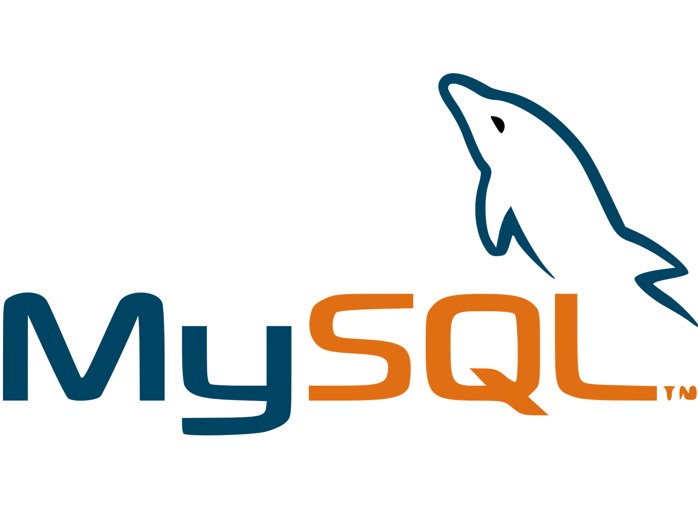

### Hi, I'm Rule Lulu! 👋🧕

I'm a beginner with a keen interest in Web Development and Data Analysis. I'm enthusiastic about embarking on my learning journey in these domains.

- 🔭 I’m currently working on a personal project.
- 🌱 I’m currently learning web development.
- 👯 I’m looking forward to collaborating with other creators.

#### Connect with Me:

You can reach out to me through the following channels:

Email: rulelulu@gmail.com

#### Languages I'm Learning and Using:
)) 
 )     ) 

<!--
**RuleLuluDamara/RuleLuluDamara** is a ✨ _special_ ✨ repository because its `README.md` (this file) appears on your GitHub profile.

Feel free to connect with me and explore opportunities for collaboration.

<!--
**RuleLuluDamara/RuleLuluDamara** is a ✨ _special_ ✨ repository because its `README.md` (this file) appears on your GitHub profile.

Here are some ideas to get you started:

- 🔭 I’m currently working on ...
- 🌱 I’m currently learning ...
- 👯 I’m looking to collaborate on ...
- 🤔 I’m looking for help with ...
- 💬 Ask me about ...
- 📫 How to reach me: ...
- 😄 Pronouns: ...
- ⚡ Fun fact: ...
-->
